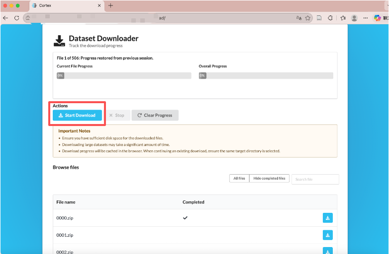
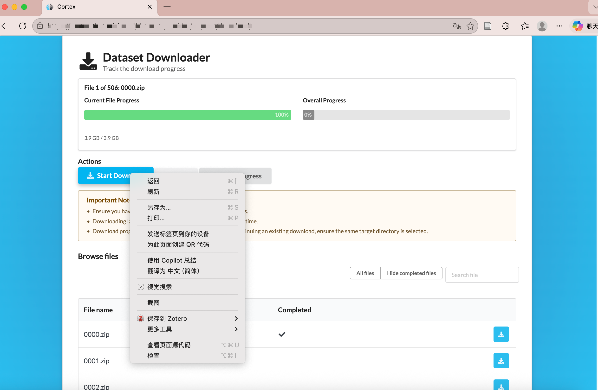
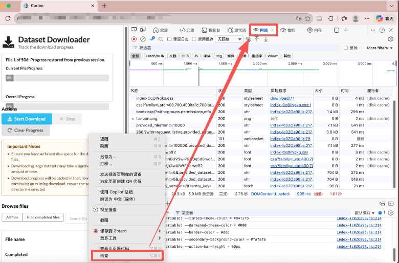
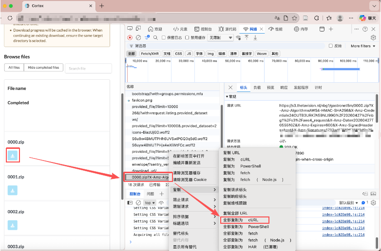

有时候下载一个数据集到远程服务器其实蛮简单的，比如右键网页选择“复制链接”，然后用 `wget` 或 `curl` 在服务器终端里直接运行就可以了。

但也有时候这个数据集是有下载权限控制的。申请通过之后，对方可能会发一个页面链接过来，可这个页面上的“download”按钮右键并没有真实文件地址 （如下图）。很多这类网站的下载方式都不是“一个按钮对应一个静态链接”，而是点击之后，浏览器先带着当前登录态去访问站内接口，再临时生成一个真正的下载链接。如果数据集很大，这时候先下载到本地再手动传到远程服务器，往往既慢又容易中断。





这时候，更稳妥的做法通常不是去找页面上的“链接”，而是去浏览器里抓一次真实下载请求，然后把这套请求改写成服务器里可运行的脚本。这个思路并不只针对某一个网站。很多带权限控制的下载页，本质上都是“页面 -> 文件列表接口 -> 生成临时下载链接的接口 -> 最终文件链接”这条链路，只是不同网站的字段名、URL 路径和文件命名方式不一样而已。

具体的操作步骤记录如下：

先打开网页的开发者工具，可以直接右键网页选择“检查”，然后点击“网络（Network）”。



然后不要一上来就点“全部下载”，而是先只点一个文件的下载按钮，或者只触发一次最小范围的下载动作。这样做的目的不是立刻把数据拿下来，而是让 Network 里只出现少量和这次下载直接相关的请求，方便判断到底哪一条才是真正有用的请求。很多时候页面本身只是 HTML，文件列表接口只会返回 JSON 元数据，而真正关键的是那个“利用当前登录态生成临时下载链接”的接口。

Note: 一般来说，优先关注点击下载按钮之后新出现的 `fetch` 或 `xhr` 请求，尤其是名字里带 `download`、`export`、`file`、`archive`、`signed_url`、`presign` 之类关键词的请求。如果某条 JSON 接口的响应里出现了 `url`、`download_url`、`signed_url`、`path`、`id`、`uuid` 这类字段，那它通常就已经非常接近真实下载链路了。真正最有价值的，往往不是最后那个很长的对象存储链接，而是前一步那个“生成临时下载地址”的站内接口，因为后者才包含你之后批量下载需要复用的 Cookie、CSRF 和请求方式。

确认之后，右键该请求，选择“复制为 cURL”。



接下来就可以从这条 cURL 里把真正可复用的部分摘出来。通常最值得关注的是 `-b '...'` 里的 Cookie、请求头里的 CSRF、`referer` / `origin`、生成下载地址的接口 URL，以及这个接口到底是 `GET` 还是 `POST`，是否还需要 `--data-raw '{}'` 之类的请求体。不同网站的接口长得会不一样，有的按文件 `id` 获取下载地址，有的按 `uuid` 获取，有的是先列文件再逐个生成下载 URL，也有的网站会一步直接返回预签名下载链接。所以这里不要把某一个站点的 URL 结构直接当成通用规则，通用的方法只是先把这条链路还原出来，再改写成脚本。

如果已经确认某个站点的大致逻辑是“先请求文件列表，再按每个文件的 `id` 或 `uuid` 获取临时下载地址，最后用这个地址下载真实文件”，那么可以改写成下面这种通用模板：

```bash
cd YOUR_PATH

COOKIE='你的完整 Cookie'
CSRF='你的 CSRF 请求头值'

# 第一步：获取文件列表
curl -fsS 'LIST_API_URL' \
  -H 'accept: application/json, text/plain, */*' \
  -H 'referer: YOUR_REFERER' \
  -b "$COOKIE" \
| jq -r 'LIST_JSON_TO_TSV_EXPRESSION' \
| while IFS=$'\t' read -r file_id file_name; do
    [ -f "$file_name" ] && echo "skip $file_name" && continue

    echo "downloading $file_name (id=$file_id)"

    # 第二步：为当前文件获取临时下载地址
    url=$(
      curl -fsS "DOWNLOAD_URL_API_TEMPLATE" \
        -H 'accept: application/json, text/plain, */*' \
        -H 'content-type: application/json' \
        -H 'origin: YOUR_ORIGIN' \
        -H 'referer: YOUR_REFERER' \
        -H "x-csrftoken: $CSRF" \
        -b "$COOKIE" \
        --data-raw '{}' \
      | jq -r '.data.url // .url'
    )

    [ -z "$url" ] || [ "$url" = "null" ] && echo "failed to get url for $file_name" && continue

    # 第三步：下载真实文件
    curl -fL -C - "$url" -o "$file_name" || {
      echo "download failed: $file_name"
      rm -f "$file_name"
      continue
    }
  done
```

这个模板里真正需要你按站点实际情况替换的，主要就是文件列表接口、把 JSON 解析成 `id + 文件名` 的那段 `jq` 表达式、生成临时下载地址的接口，以及对应的 `referer` 和 `origin`。其中 `curl -fL -C -` 这个组合比较实用：`-L` 用来跟随跳转，`-C -` 用来断点续传，`-f` 用来在 HTTP 出错时直接失败，避免把错误页面当成数据文件写到磁盘里。

整个过程需要注意: 不要一上来就跑几百个文件，最好先只测试一个文件，确认拿到的确实是临时下载地址，确认下载下来的也确实是目标文件，而不是 HTML 错误页或者 JSON，再逐步放大到前几个、前十几个，最后再全量下载。对于几百 GB 甚至几 TB 的数据集，这一步尤其重要，因为临时链接可能过期，会话可能失效，磁盘空间也可能不够，很多问题只有在真实写盘的时候才会暴露出来。